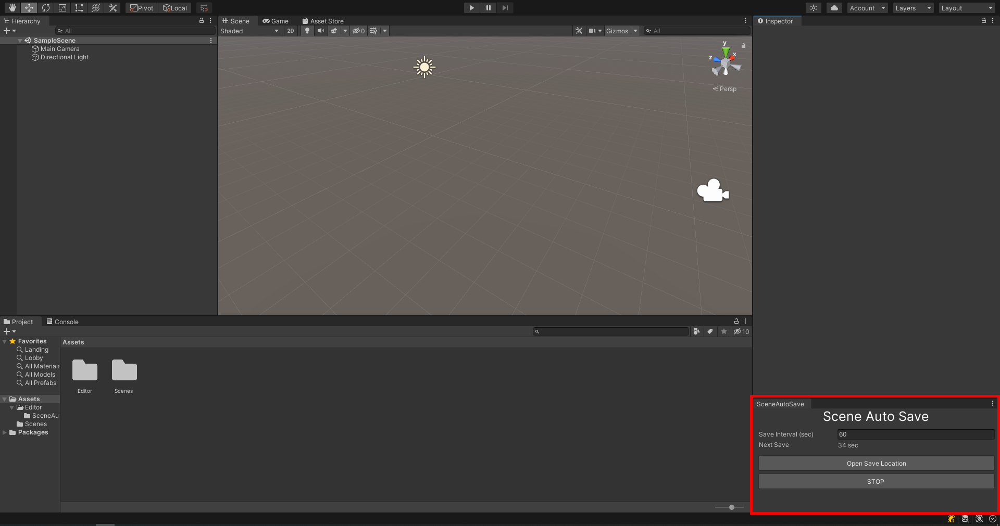

# Save Auto Scene

Automatically saves dirty scene to specific folder after a certain period of time.

## Installation

Download latest releast from **[Releases](https://github.com/SrejonKhan/SceneAutoSave/releases).** Or, put `SceneAutoSave.cs` to `Editor` folder.

After that, open editor window from `Window -> SceneAutoSave`. Set it anywhere in editor to keep in front all the time. It won't work if it is behind any other inspector or other window, as it can't call `OnInspectorUpdate()`.

  

## Todo

- [x] Automatically saves dirty scene
- [ ] Scene diff (Differentiate last saved scene)
- [ ] Scene Comparing
- [ ] Support for non-focused update
